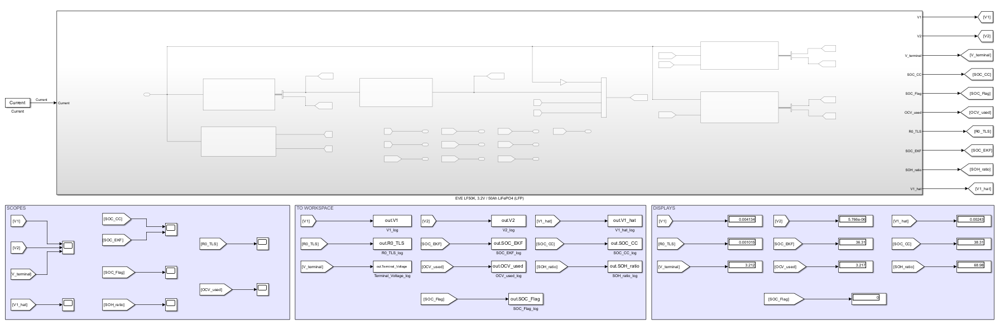
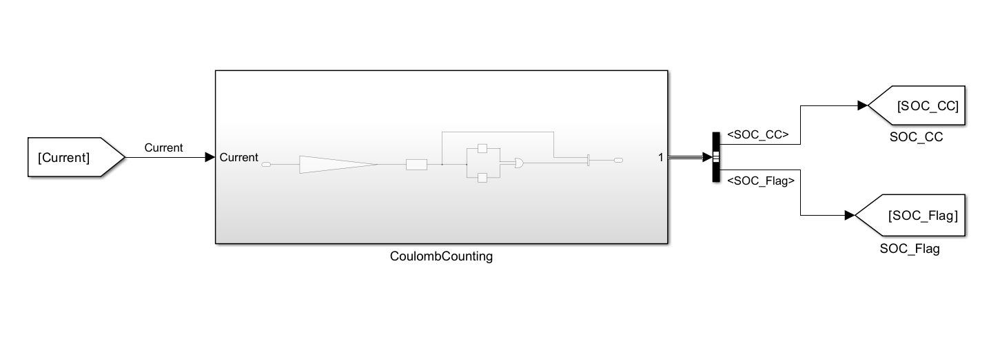
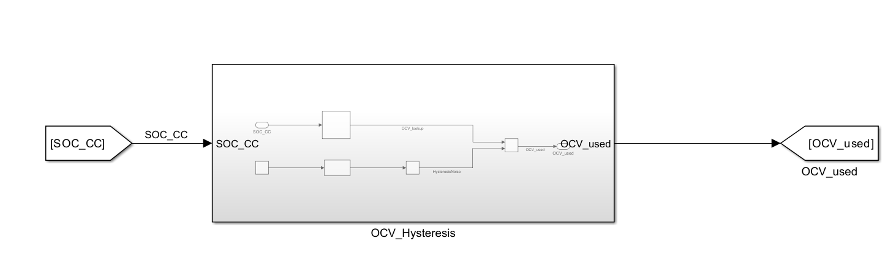
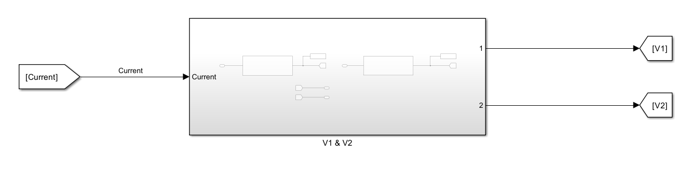
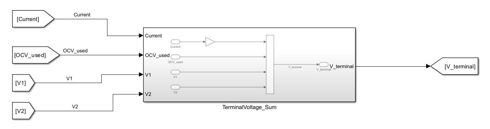
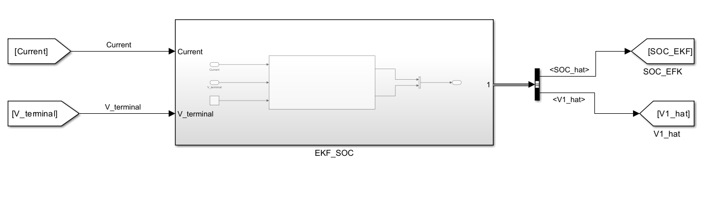
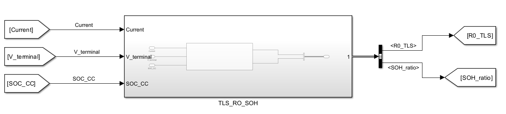
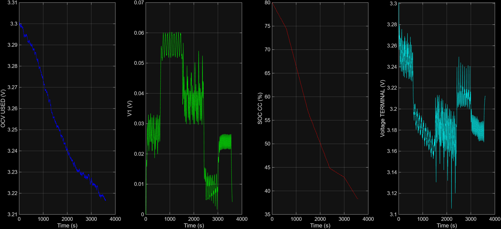
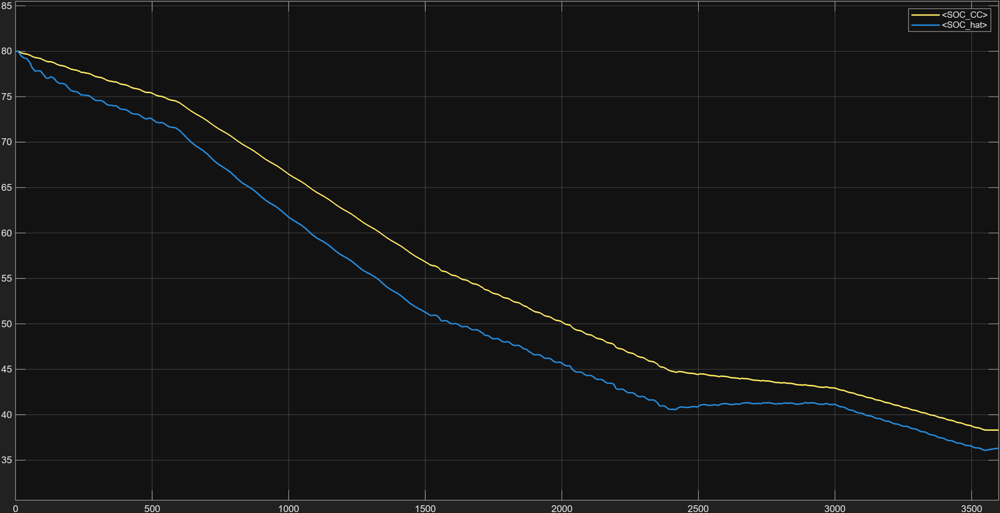
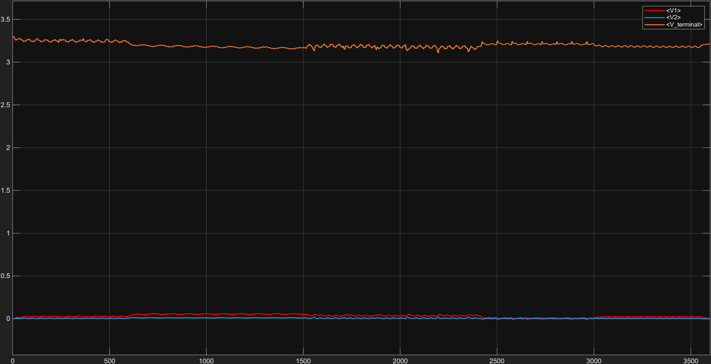

# Guardian Robot Cell Digital Twin

A Simulink digital twin of a real, commercially available LiFePO4 cell (EVE Energy LF50K, 3.2 V / 50 Ah), combining a Thevenin equivalent-circuit model (ECM) with three independent state-of-charge (SOC) estimation methods running in parallel.

Built for **Simulink for Model-Based Design — Module 3**. All four deliverable tiers are complete:

- ✅ **Core** — 1RC Thevenin ECM, OCV lookup with hysteresis noise, Coulomb Counting SOC
- ✅ **Bonus 1** — Extended to a full 2RC Thevenin ECM
- ✅ **Bonus 2** — Extended Kalman Filter SOC estimator (given implementation, integrated unmodified)
- ✅ **Bonus 3** — Total Least Squares (TLS) R0 identification + State-of-Health (SOH) ratio check

---

## Architecture

The model uses a shared-tap architecture: the current signal (and, once computed, the terminal voltage) fan out in parallel to every estimator, rather than being processed in a single serial chain — the same way a real battery management system exposes one set of sensor data to several independent algorithms at once.



**Core signal chain:**

| Subsystem | Input(s) | Output(s) | Role |
|---|---|---|---|
| `CoulombCounting` | `Current_A` | `SOC_CC`, `SOC_Flag` | Open-loop SOC via current integration, clamped to [10, 90]% |
| `OCV_Hysteresis` | `SOC_CC` | `OCV_used` | OCV(SOC) lookup + bounded hysteresis noise |
| `V1 & V2` | `Current_A` | `V1`, `V2` | 1RC (core) and 2RC (Bonus 1) polarization voltages |
| `TerminalVoltage_Sum` | `OCV_used`, `Current_A`, `V1`, `V2` | `Terminal_Voltage` | Combines all terms into the final voltage output |
| `EKF_SOC` | `Current_A`, `Terminal_Voltage` | `SOC_EKF`, `V1_hat` | Closed-loop SOC via Extended Kalman Filter (Bonus 2) |
| `TLS_RO_SOH` | `Current_A`, `Terminal_Voltage`, `SOC_CC` | `R0_TLS`, `SOH_ratio` | Resistance identification + health check (Bonus 3) |

| CoulombCounting | OCV_Hysteresis |
|---|---|
|  |  |

| V1 & V2 (1RC + 2RC branches) | TerminalVoltage_Sum |
|---|---|
|  |  |

| EKF_SOC (Bonus 2) | TLS_RO_SOH (Bonus 3) |
|---|---|
|  |  |

---

## Governing Equations

**Coulomb Counting SOC (core):**
```
SOC(k+1) = SOC(k) - (Ts / (Q_nominal * 3600)) * I(k) * 100
```

**Thevenin RC branches (core + Bonus 1):**
```
V1(k+1) = a1*V1(k) + R1*(1-a1)*I(k),   a1 = exp(-Ts / (R1*C1))
V2(k+1) = a2*V2(k) + R2*(1-a2)*I(k),   a2 = exp(-Ts / (R2*C2))
V_terminal(k) = OCV_used(SOC(k)) - I(k)*R0 - V1(k) - V2(k)
```

**TLS R0 identification + SOH (Bonus 3):**
```
V1_hat(k+1) = a1*V1_hat(k) + R1*(1-a1)*I(k)      % open-loop, given R1/C1
y(k) = OCV_used(SOC_CC(k)) - V1_hat(k) - V_meas(k)
x(k) = I(k)
D = [x - mean(x), y - mean(y)];  [U,S,V] = svd(D);
R0_TLS = -V(1,2) / V(2,2)
SOH_ratio = (R0_datasheet / R0_TLS) * 100
```

---

## How to Run

1. Place `Guardian_Battery_DriveCycle_Current.csv`, `Guardian_Battery_OCV_SOC_Table.csv`, and `EKF_SOC_Estimator.m` in your MATLAB working directory.
2. Run `Guardian_Battery_script.m` — this loads the CSVs, defines all model constants, and calls `sim('Guardian_Battery')`.
3. Open `Guardian_Battery.slx` to inspect or modify the model.
4. Logged outputs (`Terminal_Voltage_log`, `SOC_CC_log`, `SOC_EKF_log`, `R0_TLS_log`, `SOH_ratio_log`) land in the base workspace as "Structure With Time" after each run.

**Solver configuration:** Fixed-step, discrete (no continuous states), `Ts = 1 s`, `StopTime = 3599` (matching the 3600-sample, 1 Hz drive cycle exactly).

---

## Results

Full 3600-second (1 hour) drive cycle, simulated end to end:



*OCV_used, V1, SOC_CC, and Terminal_Voltage over the full run. SOC decreases from 80% toward the high-30s/low-40s % range; Terminal_Voltage tracks below OCV_used throughout, consistent with the discharge-positive sign convention.*



*Coulomb Counting (yellow) vs. the Extended Kalman Filter (blue) — both estimators track the same downward trend, diverging gradually as small per-step differences accumulate over the run.*



*The two Thevenin branch voltages stay small relative to the terminal voltage; V1 (τ ≈ 27.2 s) responds more slowly than V2 (τ ≈ 1.8 s), which settles almost immediately after each current transient.*

---

## Assumptions

- Fixed 25 °C ambient temperature throughout; no thermal sub-model.
- R1, C1, R2, C2 are not published on the LF50K datasheet — scaled from a peer-reviewed HPPC-fitted reference cell's parameters, not measured directly on this cell.
- EKF process/measurement noise covariances (`Qcov`, `Rcov`) are left at the values given in `EKF_SOC_Estimator.m`, unmodified.
- Because Coulomb Counting and the EKF both consume the identical, noise-free simulated current signal, their close tracking in this environment is expected — it does not by itself validate the EKF's real-world drift-correction benefit.

---

## License

This project is licensed under the MIT License — see [LICENSE](LICENSE) for details.

---

## Author

**Nagy**
